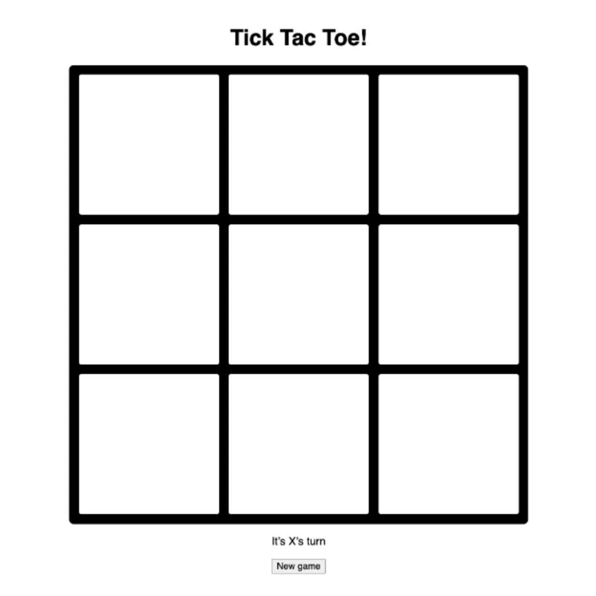

# Tic tac toe

## Description

Create a game of tic tac toe. Alternate between players “X” and “O” until one wins or the game comes to a draw. Let the players know whose turn it is by adding some UI below the game. Disable the board once the game is over or comes to a draw.

## Layout

- The title of the game is centered on the page
- The game board is a grid of 3 x 3 at ~ 650px square
- There’s some text below the game board stating which player goes next
- There is a plain reset button at the very bottom

## Interaction

- Users can click any square that’s not occupied by an X or an O
- When a win has been found the board becomes disabled and the winner is declared in place of the players turn UI
- If all of the cells are filled and no winner is found, a draw is declared in place of the players turn UI
- When the new button is pressed the game returns to its original state

## Design

It's not important to match the exact style of the demo, but here are some properties to help you get started:

**Game board**

- Title: ~2em
- Font-family: sans-serif
- Border: ~14px black
- Cell hover color: #bbf0ff

## Development environment

You are welcome to use the third-party view framework of your choice, or no framework at all. Examples of view frameworks: Vue.js, React, Angular.

However, you cannot use third-party libraries that bring in complete components with full interactions (JS), CSS and markup. Examples: Bootstrap, Material design. Reason: The purpose of the exercise is to see how you would build this component from scratch. We’ll want to have many opportunities to discuss the choices you make relating to mark-up, styling, and interactions.
